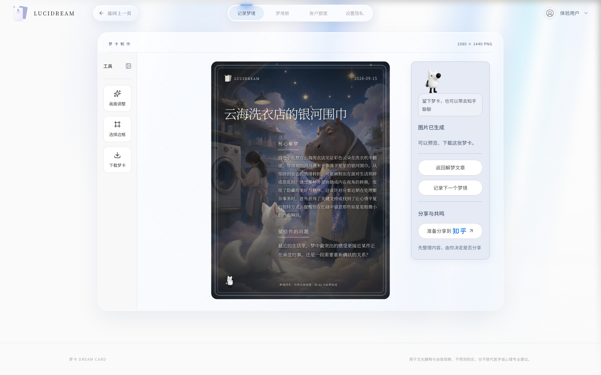
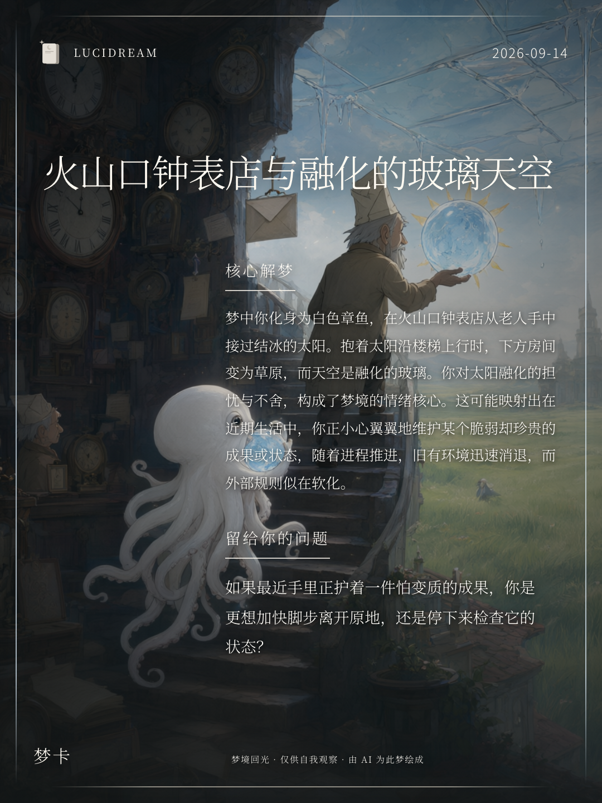
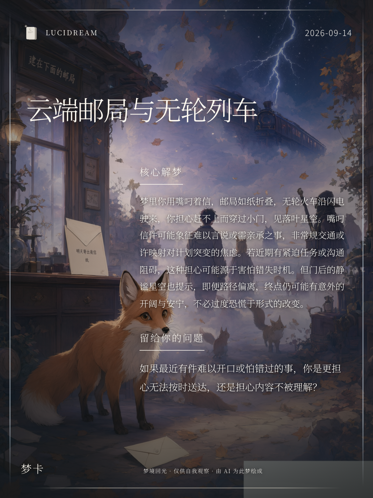
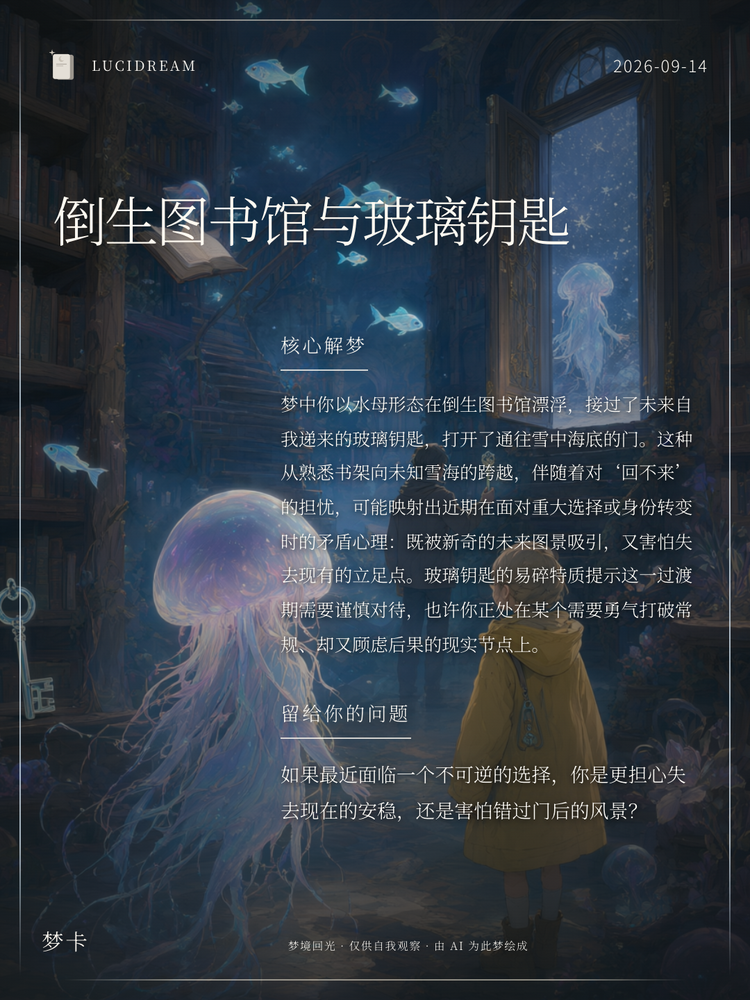

<div align="center">

# LUCIDREAM · 梦境回声

### 将梦境，留作一张卡

看山说梦 · AI 梦境解读与梦卡创作

作者 [白一帆](https://github.com/1298335431-hub) · 知乎黑客松参赛作品

[在线体验](https://seoshulk2a6fn66jib6rs.apigateway-cn-beijing.volceapi.com/) · [在线观看演示](https://zhl-1-2.github.io/lucidream/) · [本地运行](#本地运行) · [架构说明](docs/ARCHITECTURE.md)

[](https://github.com/zhl-1-2/lucidream/actions/workflows/ci.yml)

</div>

记录醒来时还记得的片段，由你确认每一处梦象，再阅读 AI 解读，生成属于这场梦的画面。梦卡可以下载留存，也可以配上自己的故事，带到知乎分享

[](https://zhl-1-2.github.io/lucidream/)

## 先看一场梦如何变成卡片

**[在线播放完整演示 · 2 分 49 秒](https://zhl-1-2.github.io/lucidream/)** · [下载 1080p 视频](https://github.com/zhl-1-2/lucidream/releases/download/demo-video-2026-09-15/lucidream-demo-1080p.mp4)

打开播放页即可观看，支持暂停、拖动进度与全屏，无需先下载文件

视频从云海洗衣店的一场梦开始，实际走过梦象确认、文字解读和画面生成，随后调整边框、下载梦卡并准备分享文案。使用真实模型生成，部分等待过程已加速并标注；视频含步骤字幕，无旁白

## 梦卡作品

以下为实际生成作品，点击图片可查看大图。画面与文字由 AI 生成，不同梦境与生成批次的结果会有差异

<table>
  <tr>
    <td width="33%"><a href="public/assets/showcase/portfolio/glass-sky.png"></a></td>
    <td width="33%"><a href="public/assets/showcase/portfolio/cloud-post-office.png"></a></td>
    <td width="33%"><a href="public/assets/showcase/portfolio/inverted-library.png"></a></td>
  </tr>
  <tr>
    <td align="center">融化的玻璃天空</td>
    <td align="center">云端邮局与无轮列车</td>
    <td align="center">倒生图书馆与玻璃钥匙</td>
  </tr>
</table>

## 从记录到分享

```text
记录梦境 → 确认梦象 → 阅读解读 → 生成梦卡 → 下载留存
                                            └→ 整理文案 → 自行到知乎发布
```

| 环节 | 可以做什么 |
| --- | --- |
| 记录与确认 | 输入梦境，修订场景、角色、物品和情绪，先确认内容再生成 |
| AI 文字解读 | 阅读梦境片段与探索性解读，支持返回修改与复制文字 |
| 梦卡创作 | 生成画面，调整展示元素与边框，导出 1080 × 1440 PNG |
| 梦境册 | 按账号回看记录，默认 8 次生图额度，同一任务故障重试不重复扣额 |
| 登录 | 支持知乎 OAuth 与独立体验码，展示已授权用户的头像和昵称 |

## 与知乎的连接

刘看山作为轻量向导陪伴不同页面，使用不同官方动作。进入页面先播放一轮，静止约 8 秒后再播放，也可以点击触发，并兼顾减少动态效果的偏好

完成梦卡后，可以编辑想分享的故事，选择是否附上解读，再下载图片、复制文案，由自己在知乎账号中发布

**当前分享需要手动发布**。应用不会以用户身份自动发帖，也不会使用产品账号代发；“打开知乎”不会自动带入文案或图片

## 体验前须知

- 线上为临时演示版，未接入持久化云存储，服务重启、回收或重新部署可能清除记录与图片，请及时下载梦卡
- 演示地址不承诺长期可用；同一个体验码对应同一个账号，不应多人共用
- AI 解读仅用于文化解释与自我探索，不预测现实，不替代医疗或心理专业建议

---

以下为开发与部署说明。如果希望本地体验，可以先使用无需模型密钥的 mock 模式

## 技术栈与目录

React 19 · TypeScript · Vite 8 · Tailwind CSS 4 · FastAPI · Python 3.11 · SQLite · Node.js OAuth 适配服务

```text
lucidream/
├── src/                      # 前端页面、组件、接口客户端与样式
├── public/assets/            # 展示梦卡、品牌字标、向导素材
├── backend/
│   ├── app/                  # API、配置、模型服务、检索与数据访问
│   ├── scripts/              # 体验码管理、知识索引、备份与验收工具
│   └── tests/                # 后端自动化测试
├── integrations/zhihu-login/ # 私有 OAuth 适配服务与测试
├── data/knowledge/           # 自建知识卡与权利审校资料，不含用户数据库
├── deployment/               # 火山引擎临时演示打包、启动及配置工具
├── tests/                    # 浏览器交互回归脚本
├── docs/                     # 架构、阶段记录与产品规范
├── .github/workflows/        # 类型检查、构建及自动化测试
└── .env.example              # 不含密钥的本地配置模板
```

## 本地运行

需要 Node.js 22.12+、pnpm 10.34.3、Python 3.11。以下命令在仓库根目录执行，适用于 macOS / Linux。

### 1. 安装与配置

```bash
pnpm install --frozen-lockfile
python3.11 -m venv .venv
.venv/bin/python -m pip install -r backend/requirements.txt
cp .env.example .env
```

模板默认使用 `mock` 模式，不需要模型密钥，不产生真实 AI 图像或模型调用费用。SQLite 用户数据库在运行时创建，不随仓库提供。

### 2. 启动后端

```bash
.venv/bin/uvicorn app.main:app --app-dir backend --host 127.0.0.1 --port 8001 --reload
```

本地接口文档见 <http://127.0.0.1:8001/docs>

### 3. 创建自己的本地体验码

另开终端，在仓库根目录运行

```bash
PYTHONPATH=backend .venv/bin/python backend/scripts/manage_invites.py --issue 1
```

体验码仅展示一次，不要提交到仓库。同一个体验码代表同一个账号，不应多人共用。

### 4. 启动前端

```bash
pnpm dev
```

打开 <http://127.0.0.1:8443/>，使用刚创建的体验码登录。前端会把 `/api` 与 `/auth/callback` 代理到后端 8001 端口；本地体验码模式无需启动知乎服务。

### 5. 可选的真实模型与知乎登录

- 在本地 `.env` 设置 `DREAMCARD_MODEL_MODE=aliyun` 和 `DASHSCOPE_API_KEY`，模型名称须与你的阿里云账号权限匹配，真实调用会计费
- 知乎登录配置、私有服务端口与回调登记见 [OAuth 接入说明](integrations/zhihu-login/README.md)
- `VITE_` 开头的变量会进入浏览器构建产物，**绝不能存放密钥**
- 原始书籍、下载材料及知识索引数据库未上传。保留自建知识卡及处理脚本，完整文献检索需在核对权利后单独准备，参见 [知识库说明](data/knowledge/README.md)

## 检查与测试

```bash
pnpm typecheck
pnpm build
pnpm test:oauth
PYTHONPATH=backend .venv/bin/pytest backend/tests -q --disable-warnings
```

GitHub Actions 自动执行上述核心检查，不使用真实密钥，不发起真实授权或发布。通过模拟测试不等于真实模型、OAuth 和生产存储全部通过验收。浏览器脚本另见 [开发指南](CONTRIBUTING.md)。

## 部署与版本边界

当前演示部署在火山引擎，前端静态资源与 FastAPI 对外提供服务，OAuth 服务只监听内部回环地址。实际演示编排见 [deployment/DEMO.md](deployment/DEMO.md)。

- 提交源码不会触发火山引擎产品服务的部署；视频预览页单独通过 GitHub Pages 发布
- 临时存储不提供跨重启历史、额度或会话的持久保障
- 长期开放前仍需补齐持久化、备份恢复、内容审核、监控与权利审校
- `docs/`、验收记录和部署文档包含阶段历史；当前产品能力以本 README 为入口，历史待办不代表当前线上状态

视频播放页源码在 `docs/video/index.html`，发布流程见 [视频预览工作流](.github/workflows/deploy-demo.yml)。该流程仅发布播放页、封面和指定 Release 的视频，不会发布后端、环境配置或用户数据

## 素材与许可

本仓库暂未授予通用开源许可。第三方依赖遵循各自许可证，知乎字标与刘看山形象权利归其权利人所有；赛事素材的使用不代表官方运营或商业授权。赛后商用需另行确认授权，见 [第三方素材说明](THIRD_PARTY_NOTICES.md)。

真实密钥、用户梦境数据库、个人会话、原始书籍、缓存及临时构建产物均不属于源码发布内容。

## 作者与反馈

**白一帆** · [GitHub @1298335431-hub](https://github.com/1298335431-hub)

体验中的问题与功能建议欢迎提交到 [Issues](https://github.com/zhl-1-2/lucidream/issues)，开发贡献见 [贡献指南](CONTRIBUTING.md)。涉及密钥、账号或隐私的问题请先阅读 [安全说明](SECURITY.md)，不要公开提交梦境隐私与凭证
